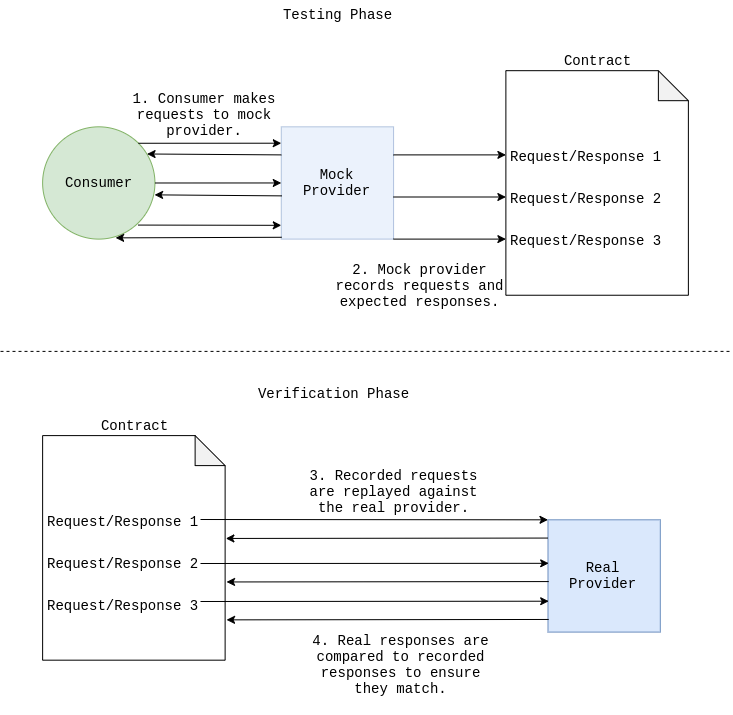

If you haven't already guessed by the title, this post is about [Consumer](https://www.thoughtworks.com/radar/techniques/consumer-driven-contract-testing)-[Driven](https://thoughtworks.github.io/pacto/patterns/cdc/) [Contract](https://martinfowler.com/articles/consumerDrivenContracts.html) testing. It's a microservice testing pattern for testing services in isolation from each other. The basic idea is that a _consumer_ service is tested against a mock of its _provider_. The mock builds a list of _interactions_ it has with the consumer, which form expectations about what the real provider service should do (and what the shape of its data looks like). These interactions are usually serialized into a file and can be replayed against the provider in its own test environment.

The idea is to ensure that services will integrate well with each other without necessarily needing to deploy an entire staging environment and perform end-to-end tests to do so.

As you may have gleaned from the earth-shatteringly witty title, this isn't about that happy scenario. This post is about my misuse of CDCs and some lessons learned.

## The Motivation
My team are currently working on a product that takes events filled with delicious, juicy __data__ from an in-house system, transforms them into a format that a 3rd-party system can handle, and throws them at a REST API that the 3rd-party system exposes.

The problem was, we had to wait until deployment to find out if we had made a mistake in implementing the consumer for the 3rd-party system. Although we were deploying to a staging environment so we weren't causing downtime for users, this development cycle still meant that we were dirtying our master branch with commits that weren't working. It would also slow down _everyone's progress_ in the team to a crawl. But we couldn't just run tests locally against the 3rd-party API, as we would be bombarding it with requests and dealing with constantly changing data!

So the question became, how do we test our consuming service against the real provider API... without actually testing it against the real provider API?

## Consumer-Driven Contracts to the rescue!
We all settled on Consumer-Driven Contract testing, [PACT](https://github.com/pact-foundation/pact-net) to be specific. I had used the Node.js version of PACT [before](https://github.com/Ricool06/breathe), so I thought we were well placed to begin using it for our situation. We went on to create an API client that we tested with a PACT mock, verified the pact artifact against the real provider API, then used a [stub generator](https://github.com/uglyog/pact-stub-server) to stub the provider in integration tests for the consumer service which used the client. This worked great! Until it didn't...

## The Problems & _Lessons Learned_ ™
First off, I want to make it clear that the problem with PACT was _the way we were using it_. The folks over at the [PACT foundation](https://github.com/pact-foundation) make a stellar tool, so be sure to show them some love this coming [Hacktoberfest](https://hacktoberfest.digitalocean.com/).

A few issues became apparent as we started to use PACT more:

### Tests failed when PACT attempted to verify the shape of empty arrays.
At first, we thought this was silly. Surely an empty JSON array must meet the criteria for being an array of a specific type of object.

But that's just it.

An empty array can meet the criteria for being an array of _any_ type in JSON. So PACT makes the decision to fail your test because, rather correctly, it can't determine that the array meets the contract. This is when we learned that [PACT testing is only suitable when you can set the provider's state](https://github.com/pact-foundation/pact-net/issues/165#issuecomment-426843392). That way we would have been able to ensure that all arrays were populated with type-checkable data.

### Authentication has to be implemented thoughtfully.
Initially, each time a request was made through the client, it would reauthenticate. This meant that our PACT mock needed to supply an endpoint that mimicked the login endpoint on the real API.

Unfortunately, we had to use our real API key in the tests so that they could generate a PACT file with a valid key to replay against the API, and this can come with a shopping list full of potential security flaws. In the end, we decided to use the very client we were testing to authenticate PACT during the verification stage in order to keep our key secure. Still, ew.

This issue was likely borne of a problem with our design of the client more than anything else. The kind of problem Consumer-Driven Contracts are designed to illuminate, but sometimes (often) the need for speedy delivery outweighs a development team's desire for gold-plated design.

### Debugging is hard.
This may not be the case for all CDC frameworks, but the dotnet version of PACT was kind of hard to debug. The library is written in C# but wraps a Ruby binary that contains the core functionality of PACT. This caused the stack traces on a test failure to be buried underneath quite a bit of other logging. To add to this, PACT enforced contracts using regex and JSON parsing. When a mismatch between the expected response and the actual response was found, that mismatch was printed out. When the response was VERY different (during the early stages of development) the page-long stack trace became burdensome to grok. And of course it was impossible to inspect the separate PACT process with a debugger.

### Auto-generated stubs aren't actually as great as they sound.
When we finally moved onto testing the consumer service that used the client, we used a utility that converts PACT files into a stub of the provider API. The problem was that it was a _very_ thin stub. It only responded properly when it received a request that exactly matched the one used to generate the pact. This was a headache as it limited the number of useful tests we could squeeze out of the stub, especially when we wanted to write a number of unhappy path tests.

## The answer:
Just use the real API. Once.

By that, I mean record real responses from the real provider and reuse them. [WireMock.Net](https://github.com/WireMock-Net/WireMock.Net/wiki/Settings#proxyandrecordsettings) has this feature, but so do many other tools in languages aside from C#. [WireMock for Java](http://wiremock.org/docs/record-playback/), [nock for JavaScript](https://github.com/nock/nock#nock-back), and [vcr for Ruby](https://github.com/vcr/vcr) to name a few.

Once we ran the tests and WireMock.Net saved the interactions to disk, we simply committed them to source control alongside the rest of the code, so that the same test data could be used next time.

This approach had the advantage of being able to use test data that __definitely__ matched the contract of the provider, because it was made by the provider. Furthermore, updating the contract was as easy as deleting the files recorded by WireMock.Net and running the tests again. We also noticed that tests could be written with far fewer lines of code, as the test data was fetched automatically, without having to describe whether fields match a certain type or regular expression.

## What Consumer-Driven Contracts are good for:
Embarassingly, the clue is in the name, and we should have understood that sooner. Consumer-__Driven__ Contracts. This microservice testing pattern is useful when developers in the same (or two closely-working) teams need to develop a number of integrated services. One developer can use a CDC framework to write tests for their consumer, essentially describing _their requirements_ for the provider service.

The generated contract can be passed to the developer of the provider so that they can implement the service _according to the requirements of the contract_.

I had it backwards the whole time, our team was using a tool that is useful for _driving requirements_, in order to meet the fixed requirements of a provider. More food for thought at least.

_By the way..._ if you liked this blog, [follow me on Twitter @Ricool06](https://twitter.com/Ricool06) for more mind-altering, life-changing, love-life-fixing, money-making dev content.

Okay maybe just normal dev content.
